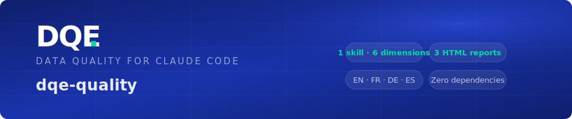
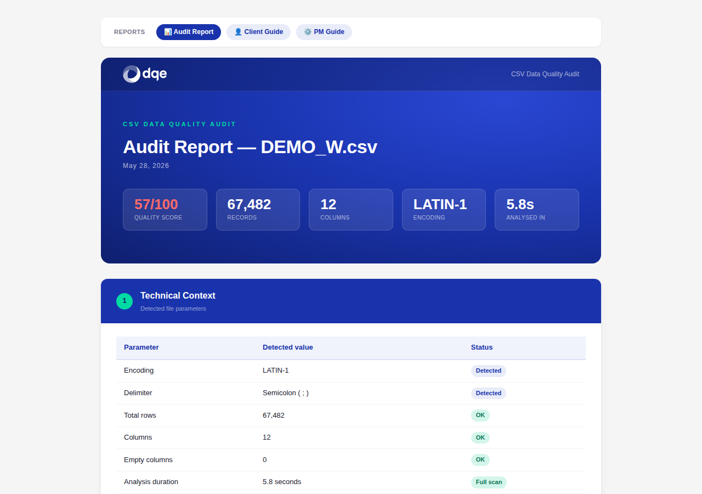
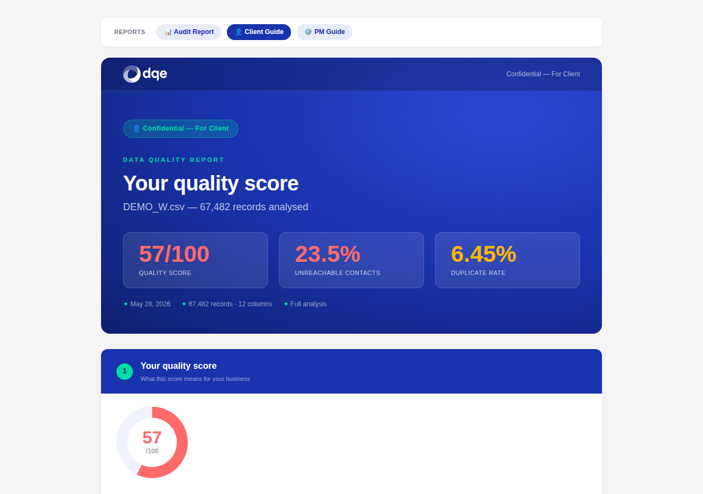
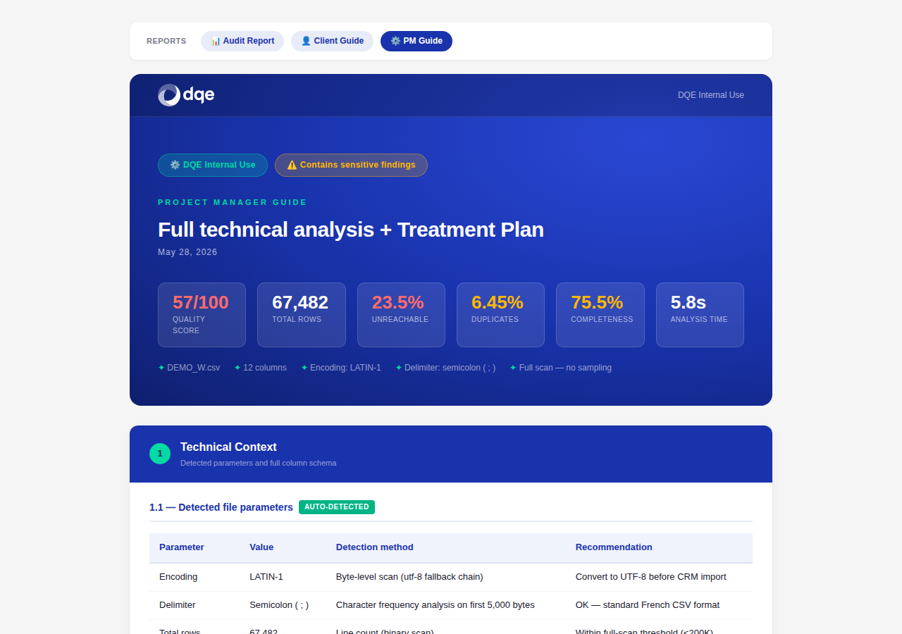

<div align="center">
  
</div>

# dqe-quality: Data Quality Audit Plugin for Claude Code

> **Growing suite of data quality tools for Claude Code by [DQE Software](https://github.com/DQE-SOFTWARE).** Currently includes 1 audit skill analysing 6 dimensions and generating 3 standalone HTML reports. More skills coming.
>
> **Note:** the plugin is named `dqe-quality` in the marketplace. The GitHub repository is named `claude-quality`.

[](LICENSE)
[](https://claude.ai/code)
[](https://github.com/DQE-SOFTWARE/claude-quality/releases)
[](https://www.python.org/)
[](#requirements)
[](#who-this-is-for)

Analyse CSV files across the 6 DQE quality dimensions and generate standalone branded HTML reports — directly from Claude Code. No pip installs, no API keys, no setup. **Your data never leaves your machine.**

> **Why dqe-quality?**
> - Drop a CSV, get 3 professional reports in under 10 seconds
> - Audit report for engineers, client guide for stakeholders, PM guide for your team
> - Multilingual output: English, French, German, Spanish — one flag away
> - **Zero-copy** — your data never leaves your machine, everything runs locally

---

## Table of Contents

- [Who this is for](#who-this-is-for)
- [Installation](#installation)
- [Quick start](#quick-start)
- [Skills](#skills)
- [The 6 dimensions](#the-6-dimensions)
- [The 3 reports](#the-3-reports)
- [Options](#options)
- [Output files](#output-files)
- [Screenshots](#screenshots)
- [File size handling](#file-size-handling)
- [Path handling](#path-handling)
- [Requirements](#requirements)
- [License](#license)

---

## Who this is for

***Data engineers and analysts*** who need a fast, reproducible quality baseline on any CSV before loading it into a pipeline or CRM.

***Project managers and consultants*** who need ready-to-share deliverables — a client-facing report and an internal treatment plan — without opening a BI tool.

***DQE Software teams*** who audit client data files and need branded, multilingual reports that tie findings directly to DQE service recommendations.

---

## Installation

### From the Claude Code marketplace

```bash
/plugins install dqe-quality
```

> The plugin is registered as **`dqe-quality`** in the marketplace. The underlying GitHub repository is `DQE-SOFTWARE/claude-quality`.

### Manual (git clone)

```bash
git clone https://github.com/DQE-SOFTWARE/claude-quality.git
cd claude-quality
bash install.sh
```

### Requirements

- [Claude Code](https://claude.ai/code) CLI or IDE extension
- Python 3.x — standard library only, **no `pip install` needed**

---

## Quick start

```bash
# Basic audit — English report (default)
/dqe-audit ~/data/clients.csv

# French report
/dqe-audit ~/data/clients.csv --lang=fr

# Spanish report
/dqe-audit ~/data/clientes.csv --lang=es

# Windows path (auto-converted to WSL)
/dqe-audit "C:\Users\demo\data\export.csv" --lang=de
```

Three HTML files are written next to the source CSV within seconds.

---

## Skills

### `/dqe-audit <path/to/file.csv> [--lang=fr|en|us|de|es]`

Runs a full data quality audit on a CSV file and generates 3 standalone HTML reports.

| Argument | Description |
|---|---|
| `path/to/file.csv` | Path to the CSV file — relative, absolute, or Windows format |
| `--lang=XX` | Report language: `en` (default), `us` (alias for en), `fr`, `de`, `es` |

---

## Multilingual column detection

The engine auto-detects column types from their names across four languages. You do not need to rename your columns — bring the file as-is.

| Context | French | English | German | Spanish |
|---|---|---|---|---|
| First name | `prenom`, `prenom_1` | `firstname`, `first_name` | `vorname` | `nombre`, `nombre_de_pila` |
| Last name | `nom`, `nom_famille` | `lastname`, `last_name`, `surname` | `nachname`, `familienname` | `apellido`, `apellidos` |
| Address | `adresse`, `rue` | `address`, `street` | `strasse` | `direccion`, `calle`, `domicilio` |
| Address 2 | `compl`, `bat`, `appt` | `addr2` | — | `piso`, `complemento` |
| Postal code | `cp`, `code_postal` | `zipcode`, `zip_code`, `postcode` | `plz`, `postleitzahl` | `codigo_postal`, `codigopostal` |
| City | `ville`, `commune` | `city`, `town` | `stadt`, `ort` | `ciudad`, `municipio`, `localidad`, `poblacion` |
| Country | `pays` | `country` | `land` | `pais` |
| Email | `mail`, `courriel` | `email` | `email` | `email` |
| Phone (landline) | `fixe`, `tel`, `telephone` | `phone` | `festnetz` | `telefono`, `fijo`, `tel_fijo` |
| Phone (mobile) | `portable`, `mob` | `mobile`, `cell` | `handy`, `mobilnummer` | `movil`, `celular` |
| Date | `date_*`, `naiss`, `modif` | `date_*`, `birth`, `update` | — | `fecha_*` |
| Salutation | `civ`, `sexe`, `genre` | `gender`, `title` | `anrede` | `tratamiento`, `genero` |
| Company | `entreprise`, `societe`, `enseigne` | `company` | `firma`, `unternehmen` | `empresa`, `compania`, `sociedad` |

> Partial matches work too: a column named `fecha_nacimiento` is detected as a date field, `apellido_paterno` as a last name.

---

## Postal code validation

When a country column is present, postal codes are validated per row against that row's declared country. When no country column exists, the engine infers the dominant format from the data itself.

| Country | Accepted formats | Notes |
|---|---|---|
| France (`FR`, `FRANCE`, `FRA`) | `\d{5}` | Exactly 5 digits |
| Germany (`DE`, `GERMANY`, `DEUTSCHLAND`) | `\d{5}` | Exactly 5 digits |
| Spain (`ES`, `SPAIN`, `ESPAGNE`, `ESPAÑA`) | `\d{5}` | 5 digits, province range 01–52 |
| USA (`US`, `USA`, `UNITED STATES`) | `\d{5}` or `\d{5}-\d{4}` | Base ZIP or ZIP+4 |

Invalid codes are reported in **Dimension 5 — Broken Relationships**, grouped by country.

---

## The 6 dimensions

| # | Dimension | What it detects |
|---|---|---|
| 1 | **Completeness** | Fill rate per column, globally empty fields |
| 2 | **Invalid dates** | Format errors, future dates, impossible values, mixed formats |
| 3 | **Duplicates** | Exact duplicates, near-duplicates (name+email, name+address) |
| 4 | **Anomalies** | Statistical outliers, generic values (null, test, xxx…), digits in text fields |
| 5 | **Broken relationships** | Postal code format per country (FR/DE/ES/US), ZIP/city mismatches, unreachable contacts (no email, no phone) |
| 6 | **Format inconsistencies** | Mixed phone formats, inconsistent casing, type heterogeneity |

---

## The 3 reports

### 📊 Audit Report — technical

Full technical analysis for data engineers and analysts.

- Quality score (0–100) with colour-coded rating
- Column profiling: detected type, fill rate, dominant value type
- Executive summary with 6 dimension cards
- Detailed per-dimension analysis with issue lists and counts
- DQE service recommendations based on findings
- Conclusion

### 👤 Client Guide — business

Business-oriented report for the end client. No technical jargon.

- Key metrics at a glance: score, unreachable contacts %, duplicate %
- Score gauge with business impact explanation
- 6 dimensions in plain language with concrete impact statements
- Business impact table: problem / estimated volume / activity impact / priority
- Next steps checklist
- DQE contact CTA

### ⚙️ Project Manager Guide — internal

Advanced technical document for DQE teams.

- Detected parameters: encoding, delimiter, row/column counts, analysis mode
- Full column schema with top values and type distribution
- Detailed per-dimension analysis with problematic value examples
- Quality score formula with actual values
- Prioritised treatment plan: dimension / volume / recommended DQE service / estimated effort / expected gain
- Technical configuration cards per relevant service
- Full column appendix

---

## Options

### `--lang` — Report language

Controls the language of all generated HTML reports. Default: `en`.

| Value | Language | Notes |
|-------|----------|-------|
| `en` | English | Default |
| `us` | English | Alias for `en` |
| `fr` | French | |
| `de` | German | |
| `es` | Spanish | |

---

## Output files

Three HTML files are written next to the source CSV:

```
<basename>_dqe_audit_YYYYMMDD_<lang>.html
<basename>_dqe_client_guide_YYYYMMDD_<lang>.html
<basename>_dqe_pm_guide_YYYYMMDD_<lang>.html
```

The three reports link to each other via a shared navigation bar.

**Collision guard:** if a file with the same name already exists, a numeric suffix is appended automatically:
```
clients_dqe_audit_20260528_en (2).html
```

---

## Screenshots

| 📊 Audit Report | 👤 Client Guide | ⚙️ PM Guide |
|---|---|---|
|  |  |  |

---

## File size handling

| File size | Behaviour |
|-----------|-----------|
| Up to 200k rows | Full analysis — every row |
| 200k – 500k rows | Auto-sampled (1 in N rows), result extrapolated |
| Above 500k rows | Rejected — tip provided to extract a sample with `head` |

The report indicates when sampling was applied.

---

## Path handling

- Relative and absolute paths are both accepted
- Windows paths (`C:\Users\...`) are automatically converted to WSL paths (`/mnt/c/Users/...`)

---

## Requirements

- [Claude Code](https://claude.ai/code) CLI or IDE extension
- Python 3.x — standard library only, no `pip install` needed

---

## License

MIT — © 2026 [DQE Software](https://github.com/DQE-SOFTWARE)
